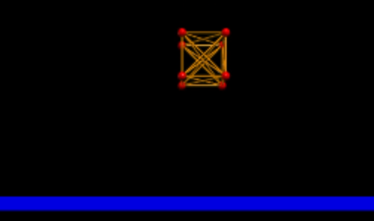
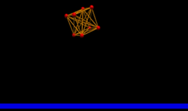
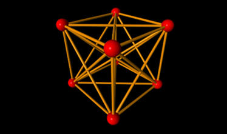
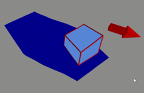
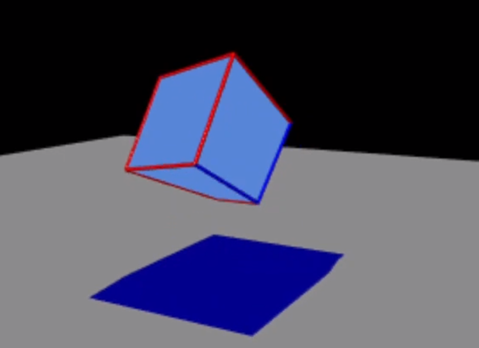
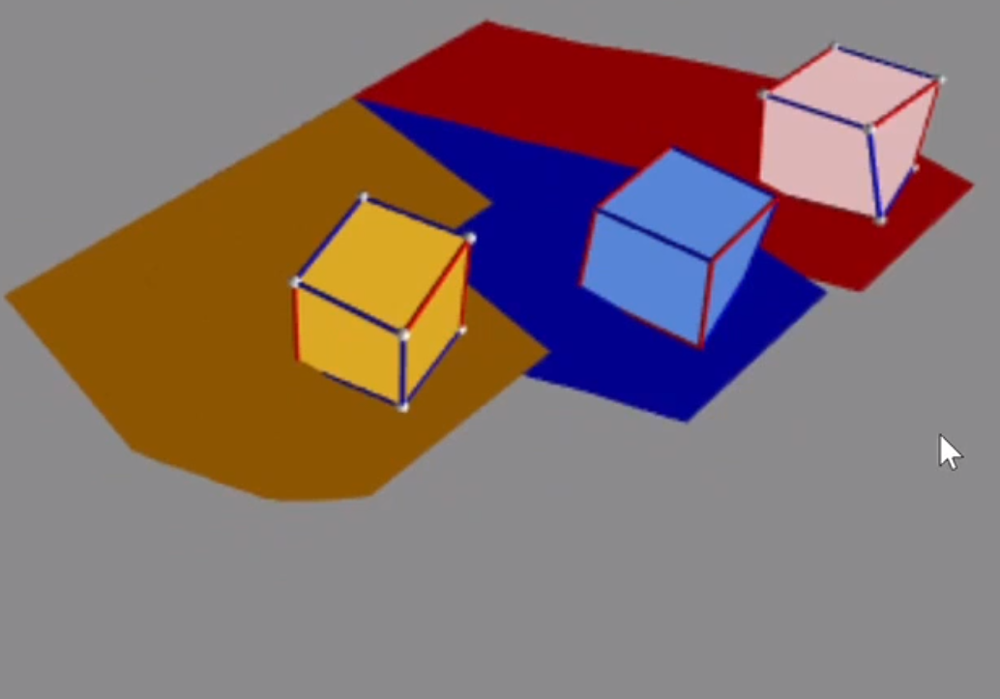

Cooperated with [Li](https://github.com/davit666), Robot Morphology evolved using Evolutionary Computation.

The physics simulator is implemented in VPython. Exactly 1m above a flat plane, a cube has been created by locating 8 spherical masses (balls) and by connecting 28 springs: 12 on edges, 12 on short diagonals, and 4 on long diagonals. Video demonstrations of the cube bouncing on a flat plane have been recorded and have been uploaded to links in YouTube. For observation, balls and spring cylinders are drawn with the radius of 0.01m and 0.002m. Two data structures have been developed for balls and springs, allowing them to store forces (F), accelerations (a), velocities (v), and positions (p) in 3D vectors. Global unit is in metric and setup coefficients are listed in table 1. 

### Phase 1  

Bouncing Cube Dropping without Angle, YouTube: https://youtu.be/sOoYNzUU3cI    
  

Bouncing Cube Dropping with Angle, YouTube: https://youtu.be/YyZfDnKLnGo  
  
  

Breathing Cube, YouTube: https://youtu.be/sfoUWRRYVmc    
   

### Phase 2  

Cube Robot Moving, YouTube: https://youtu.be/axqB0OySes0 
   

Cube Robot Moving when Dropping, YouTube: https://youtu.be/I1Dhe4EXiVY  
   

Multiple Cube Robots Moving, YouTube: https://youtu.be/NkSaKnVlpGA  
  

### Phase 3  

Robot Zoo Robot Zoo, YouTube: https://youtu.be/ItwSuuhFC3M  
  

Robot Morphology, Robot Moving Video, YouTube: https://youtu.be/x9itOYzMm1k  

Robot Morphology, Robot Bouncing, YouTube: https://youtu.be/9rHuvvUMqUM  

Robot Morphology, Multiple Robots, YouTube: https://youtu.be/B8z7qMbDXek

### Future Phase 

Innovative Robot Moving, YouTube: https://youtu.be/D1MuorOrAQQ  

