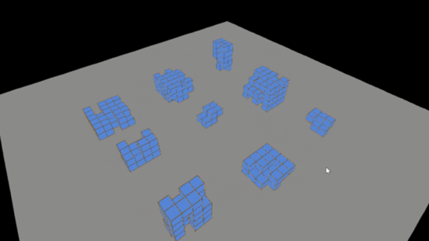

Cooperated with [Li](https://github.com/davit666), Robot morphology has been evolved using Evolutionary Computation. The physics simulator is implemented in VPython. 

### Phase 1  

Bouncing Cube Dropping without Angle, YouTube: https://youtu.be/sOoYNzUU3cI    
  

Bouncing Cube Dropping with Angle, YouTube: https://youtu.be/YyZfDnKLnGo  
  
  

Breathing Cube, YouTube: https://youtu.be/sfoUWRRYVmc    
   

### Phase 2  

Cube Robot Moving, YouTube: https://youtu.be/axqB0OySes0 
   

Cube Robot Moving when Dropping, YouTube: https://youtu.be/I1Dhe4EXiVY  
   

Multiple Cube Robots Moving, YouTube: https://youtu.be/NkSaKnVlpGA  
  

### Phase 3  

Evolving Different Robot Morphology, YouTube: https://youtu.be/ItwSuuhFC3M  
  

Robot Morphology, Robot Moving Video, YouTube: https://youtu.be/x9itOYzMm1k  

Robot Morphology, Robot Bouncing, YouTube: https://youtu.be/9rHuvvUMqUM  

Robot Morphology, Multiple Robots, YouTube: https://youtu.be/B8z7qMbDXek

### Future Phase 

Innovative Robot Moving, YouTube: https://youtu.be/D1MuorOrAQQ  

